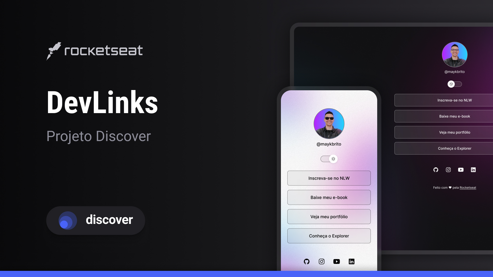

# 📅 projeto frontend com a Rocketseat

Programa exclusivo e gratuito, promovido pela Rocketseat para ensino de tecnologias WEB.

 

## 🚀 Tecnologias
Esse projeto foi desenvolvido com as seguintes tecnologias:

- **HTML e CSS**
- **JavaScript**
- **Git e Github**

---

## 💻 Projeto
O **projeto devLinks** é um projeto para aprender o básico do desenvolvimento frontend.

---

## 🔖 Layout
Você pode visualizar o layout do projeto através [DESSE LINK](https://www.figma.com/community/file/1187422022288947321).  
É necessário ter conta no Figma para acessá-lo.

---

## 📝 Licença
Esse projeto está sob a licença **MIT**.

---

Feito por Marcos França com a [Rocketseat](https://rocketseat.com.br) 👋  
Participe da nossa comunidade!